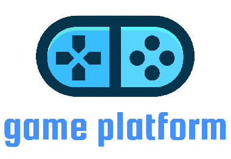

# GamePlatform

### IL PROGETTO E' UNA SIMULAZIONE, I LOGHI E IL NOME DELL'AZIENDA SONO STATI USATI SOLO A SCOPI EDUCATIVI IN AMBITO UNIVERSITARIO.

### THE PROJECT IS A SIMULATION, THE LOGOS AND COMPANY NAME HAVE BEEN USED FOR UNIVERSITY EDUCATIONAL PURPOSES ONLY.

Hanno contribuito a questo progetto: 

* [Francesco Paolo D'Antuono](https://github.com/CpDant)
* [Ciro Vitale](https://github.com/cirovitale)
* [Luigi Consiglio](https://github.com/luicons01)

## Intro

GamePlatform è un sito e-commerce pensato e realizzato per i videogiocatori che vogliono accedere ad una serie di videogiochi con prezzi abbordabili, usufruendo di abbonamenti
che permettono di risparmiare accedendo ad un insieme di videogiochi piuttosto che effettuare acquisti singoli che risulterebbero essere economicamente svantaggiosi.

Lo scopo di GamePlatform è quello di rendere l'esperienza dell'utente quanto più appagante e intuitiva possibile. 

Il team si è impegnato ad individuare le figure professionali indispensabili per la gestione di tutte le funzionalità del sito (admin, supervisore videogiochi e assistente cliente).
Abbiamo analizzato, individuato ed implementato le funzionalità principali che un sito e-commerce deve necessariamente avere, in particolare il nostro sito di abbonamenti/videogiochi.

## Installazione

L'applicazione GamePlatform non ha bisogno di una vera e propria installazione. Nonostante ciò, per come è
distribuita (tramite codice sorgente disponibile in questa repo), essa ha bisogno di vari software dai quali dipende.

### Lato client

Su macchina client gli unici requisiti sono una connessione a internet e un browser web.

### Lato server

Per il corretto funzionamento dell'applicazione lato server sono necessari:
* Java (v.11)
* Tomcat (v.9.0.59)
* MySQL Server (v.8.0.27)

Le versioni tra parentesi si riferiscono a quelle utilizzate per lo sviluppo ed il testing di GamePlatform. Di
conseguenza il corretto funzionamento è assolutamente garantito solo utilizzando le versioni specificate, ma è comunque
possibile che utilizzando altre versioni (soprattutto successive) tutto funzioni perfettamente.

Il database ha bisogno di poter essere acceduto in locale su porta 3306 tramite username "root" e password "admin".

Per la creazione dello schema necessario (denominato "gameplatform") nel database è possibile eseguire lo script GAME_PLATFORM.sql
da scaricare [qui](gamePlatformSite/db/GAME_PLATFORM.sql).

Inoltre per popolare il database è prevista una servlet di popolamento locata [qui](gamePlatformSite/src/main/java/it/unisa/gp/control/PopolamentoDBServlet.java).

